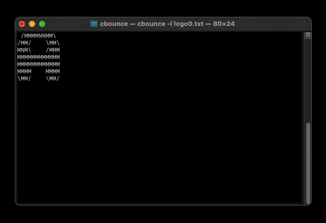

# cbounce

A bouncing-dvd-like screensaver for your terminal. Movement speed is adjustable,
graphics can be loaded from text files or generated using figlet. 


## Usage
`-s [speed]` number of charcters the logo moves per frame

`-d [delay]` time between frames in milliseconds

`-l [path]` load logo from text file

`-t [string]` use a simple line of text as logo

`-f [string]` create logo with figlet (requires[ figlet](http://www.figlet.org))

(Note: When generating lowercase figlets, there can end up some blank lines above the letters,
causing the logo's hitbox to be larger than it should be)

Press `q` to quit cbounce.


## Example

`cbounce -l logo0.txt`




## Installation

To install cbounce, clone the repository and install via makefile:
```
git clone https://github.com/randmeer/cbounce
cd cbounce
```
```
sudo make install
```
To uninstall cbounce, run
```
sudo make uninstall
```